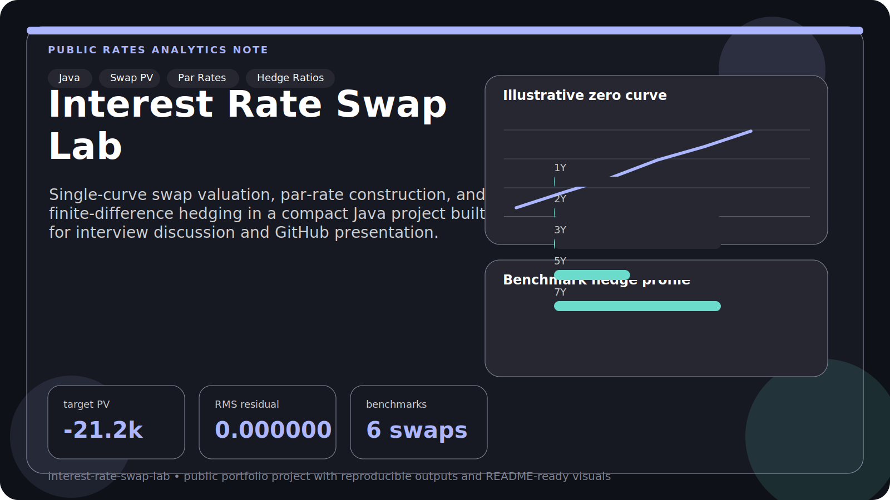
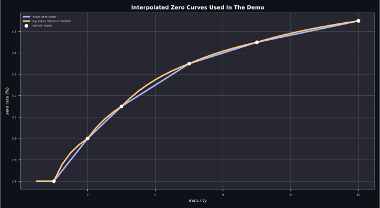
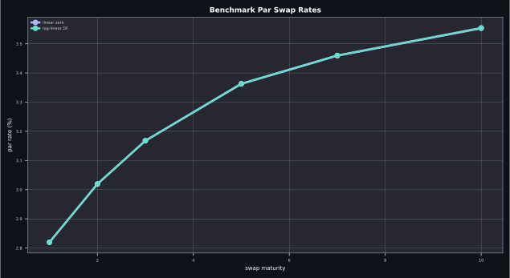
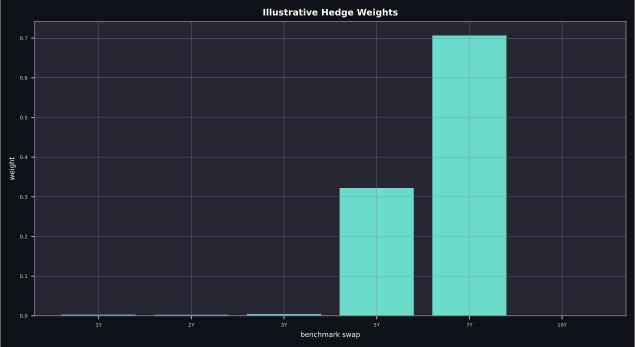
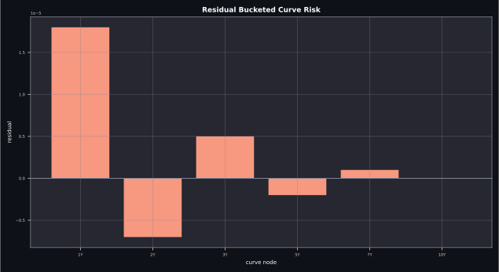

<div align="center">
  <h1>Interest Rate Swap Lab</h1>
  <p><strong>A public-facing Java project for swap valuation, par-rate calculation, and finite-difference hedge construction on a single discount curve.</strong></p>
  <p>Built as a compact portfolio project with clear structure, documentation, and interview-friendly outputs.</p>
</div>

<p align="center">
  <code>java</code>
  <code>interest rates</code>
  <code>swap valuation</code>
  <code>curve analytics</code>
  <code>hedge ratios</code>
  <code>finite differences</code>
</p>



## At A Glance

| Surface | Purpose |
| --- | --- |
| Yield curve engine | Builds discount factors and forwards from zero-rate inputs |
| Swap pricer | Values a fixed-for-floating swap on a single curve |
| Par rate analytics | Computes benchmark fixed rates for standard maturities |
| Hedge builder | Matches curve-node sensitivities with benchmark swap weights |
| Demo runner | Prints a compact scenario that is easy to discuss in interviews |

## Overview

This project focuses on three compact but practical fixed-income tasks:

- valuing a plain fixed-for-floating interest-rate swap on a single curve
- computing par swap rates for standard benchmark maturities
- building a hedge portfolio by matching bucketed curve sensitivities with finite differences

The goal is to show pricing intuition, curve mechanics, and implementation quality in a way that is easy to explain in a portfolio or interview.

## What It Shows

- curve construction from zero-rate inputs
- two interpolation styles:
  `LINEAR_ZERO_RATES` and `LOG_LINEAR_DISCOUNT_FACTORS`
- swap PV decomposition through forward rates and discount factors
- par-rate calculation for benchmark swaps
- curve-node sensitivity estimation via bump-and-revalue
- hedge weights solved from a least-squares replication problem

## Quick Start

Prerequisites:

- Java 17+
- Maven 3.9+

```bash
mvn test
mvn exec:java
```

## Preview

<p align="center">
  
  
</p>
<p align="center">
  
  
</p>

## Sample Workflow

The demo program:

1. builds an upward-sloping yield curve
2. values a target swap
3. computes benchmark par swaps
4. estimates bucketed PV01-style sensitivities
5. solves for hedge weights across benchmark swaps
6. prints the residual curve-risk mismatch

## Example Output

```text
=== LINEAR_ZERO_RATES ===
Target swap PV: -21192.95
Benchmark par rates:
  1.0Y swap -> 2.8197%
  2.0Y swap -> 3.0192%
  3.0Y swap -> 3.1675%
  5.0Y swap -> 3.3624%
  7.0Y swap -> 3.4590%
  10.0Y swap -> 3.5531%
Hedge weights:
  1.0Y benchmark -> 0.0028
  2.0Y benchmark -> 0.0025
  3.0Y benchmark -> 0.0044
  5.0Y benchmark -> 0.3222
  7.0Y benchmark -> 0.7068
  10.0Y benchmark -> 0.0000
RMS residual: 0.000000
```

## Why This Reads Well On GitHub

- It has a small enough scope to understand quickly, but still tells a real fixed-income story.
- The code is split into reusable building blocks instead of living inside one assignment file.
- The demo output gives a concrete result, not just abstract formulas.

## Project Structure

```text
interest-rate-swap-lab/
├── pom.xml
├── README.md
├── assets/
│   ├── cover.svg
│   ├── curve-view.svg
│   ├── hedge-weights.svg
│   ├── par-rate-grid.svg
│   └── risk-residuals.svg
└── src/
    ├── main/java/com/lingxin/interestrates/
    │   ├── DemoMain.java
    │   ├── HedgePortfolioResult.java
    │   ├── InterpolationMode.java
    │   ├── MatrixAlgebra.java
    │   ├── PlainSwap.java
    │   ├── SwapAnalytics.java
    │   └── YieldCurve.java
    └── test/java/com/lingxin/interestrates/
        └── SwapAnalyticsTest.java
```

## Notes

- The project intentionally keeps the market model simple so the pricing and hedging logic stay transparent.
- The hedge is constructed with finite differences on curve nodes, which makes the mechanics visible and easy to extend.
- The README charts are portfolio-facing visual summaries of the demo scenario and benchmark grid.
